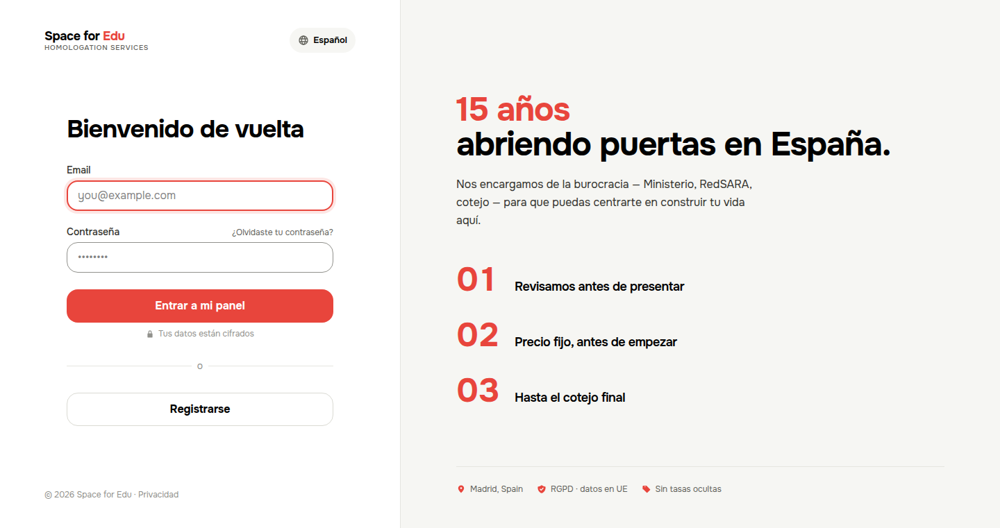
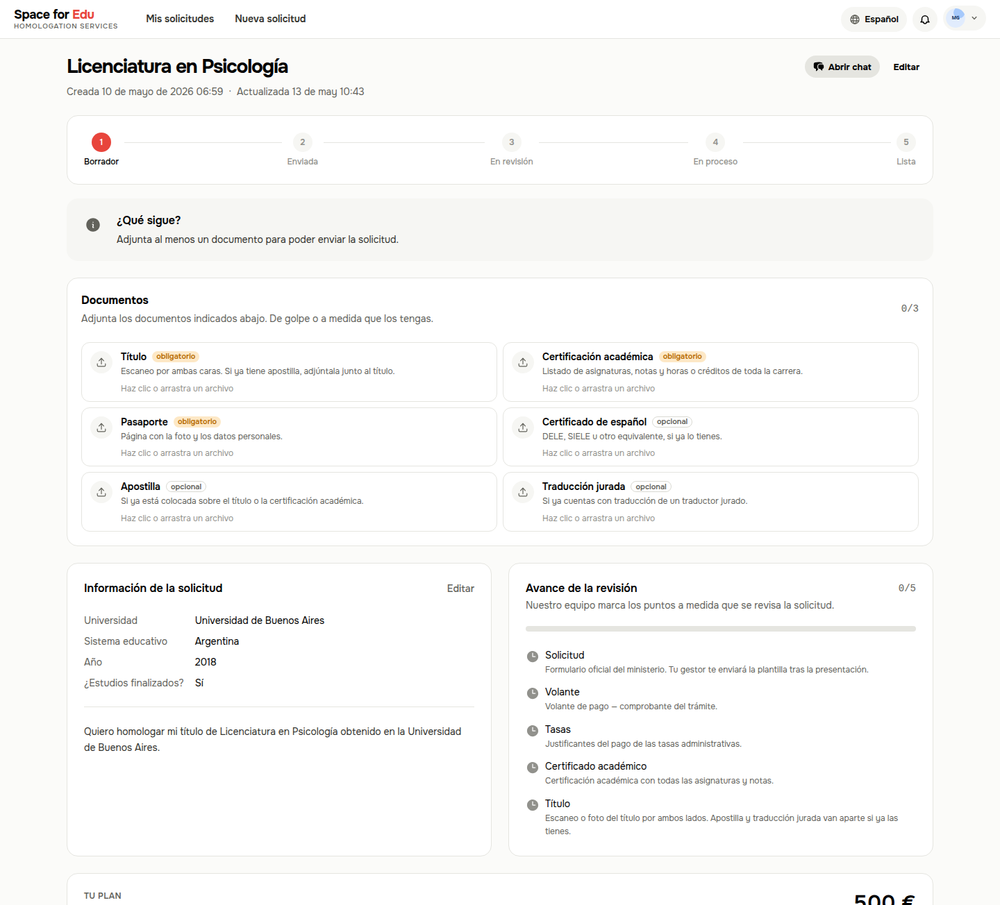
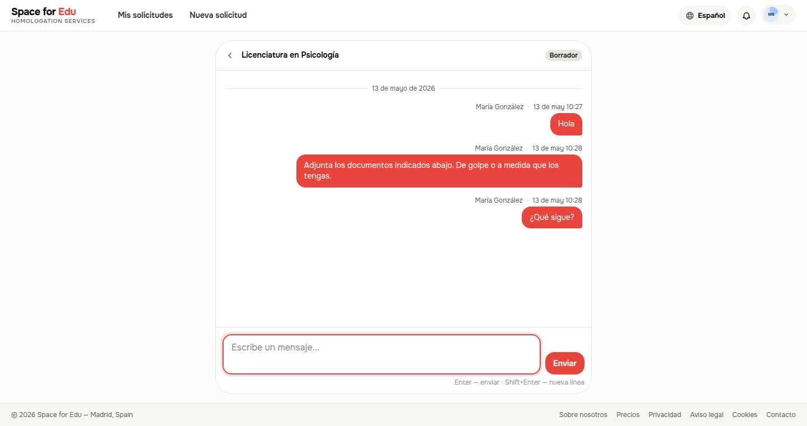

# SpaceForEdu

A case-management web app for international students going through document homologation (equivalency recognition) in Spain. Students submit requests, upload supporting documents, and communicate with an admin who guides them through the process. Payments are handled via Stripe.

**Key features:**
- Request pipeline with statuses (draft → submitted → in review → awaiting payment → resolved)
- Secure document uploads (PDF, JPEG, PNG, WebP — up to 15 MB each)
- Real-time chat between student and admin per request
- Stripe payment integration with webhook confirmation
- In-app and web push notifications
- Role-based access: student and super-admin

## Screenshots

Sign-in:



Request detail — pipeline, document checklist, review progress:



Per-request chat between student and admin:



## Requirements

- **Ruby** 3.4.9
- **Bundler** (`gem install bundler`)
- **Node.js** (any recent LTS version)
- **SQLite3** (usually pre-installed on macOS/Linux)

The easiest way to install Ruby is via [mise](https://mise.jdx.dev/) or [rbenv](https://github.com/rbenv/rbenv).

## Setup

```bash
# 1. Install Ruby dependencies
bundle install

# 2. Create and seed the database
bin/rails db:create db:migrate db:seed

# 3. Set up credentials (Stripe keys live here)
#    The vault is already committed; ask a teammate for the master key
#    and place it in config/master.key (not committed to git)
```

## Running locally

You need two processes running at the same time. The simplest way:

```bash
# Option A — with foreman (install once: gem install foreman)
foreman start -f Procfile.dev

# Option B — two separate terminals
bin/rails server              # terminal 1: web server on http://localhost:3000
bin/rails tailwindcss:watch   # terminal 2: CSS compiler
```

Open [http://localhost:3000](http://localhost:3000).

## Stripe webhooks (optional for local dev)

To test payments locally, forward Stripe events to your machine:

```bash
stripe listen --forward-to localhost:3000/payments/webhook
```

The webhook secret printed by this command goes into Rails credentials under `stripe.webhook_secret`.

## Running tests

```bash
bin/rails test
```

## Quick replies (chat templates for super_admin)

The chat shows pre-baked reply pills above the message box — only for super_admin. Click a pill to drop the template into the textarea (admin then edits and sends).

Templates live in **`config/quick_replies.yml`** — no admin UI, no database row. Edit the file, deploy.

Structure: locale → list of categories → list of replies.

```yaml
es:
  - label: "Documentos"
    items:
      - id: docs_apostille_missing
        label: "Falta apostilla"
        body: |
          {student}, el certificado no está apostillado. Sin la apostilla
          no podemos continuar.
```

Available variables: `{student}`, `{subject}`, `{plan}`, `{amount}`. Each is substituted server-side from the open conversation. Locales `es`, `en`, `ru` are supported — each admin sees the templates in their own language.

To add or edit a template:

1. Edit `config/quick_replies.yml`
2. Commit
3. Deploy (see below) — no migration needed

## Deployment

Production runs on a single VPS via [Kamal](https://kamal-deploy.org). Solid Queue runs in-process inside Puma (no separate worker), and SQLite + Active Storage live on a Docker volume named `spaceforedu_storage`.

### First-time setup (you do this once)

1. **Configure the target.** Edit `config/deploy.yml` and replace the three placeholders:
   - `image: YOUR_GITHUB_USERNAME/spaceforedu`
   - `servers.web: [YOUR_VPS_IP]`
   - `proxy.host: YOUR_DOMAIN`

2. **Provide secrets on your local machine:**
   - `config/master.key` — copy from a teammate (used by `.kamal/secrets` to inject `RAILS_MASTER_KEY` into the container).
   - `KAMAL_REGISTRY_PASSWORD` in your shell — a [GitHub Container Registry token](https://github.com/settings/tokens) with `write:packages`.
     ```bash
     export KAMAL_REGISTRY_PASSWORD=ghp_...
     ```

3. **Bootstrap the server** (installs Docker on the VPS, sets up the proxy):
   ```bash
   bin/kamal setup
   ```

That's it. The app is now live on `https://YOUR_DOMAIN`. SSL is managed automatically by the Kamal proxy.

### Routine updates (every deploy after that)

After any code change — quick reply edits, locale tweaks, bug fixes:

```bash
git pull              # get the latest code (or push your local changes first)
bin/kamal deploy      # build image, push to registry, restart on the server
```

A deploy takes 1–3 minutes depending on what changed. Zero downtime — the proxy holds requests while the new container boots.

If you only changed environment variables or secrets (not code):

```bash
bin/kamal env push    # update env vars without rebuilding the image
```

### Common operations

These shortcuts are pre-defined in `config/deploy.yml`:

```bash
bin/kamal console     # Rails console on the live app
bin/kamal logs        # tail application logs
bin/kamal shell       # bash inside the running container
bin/kamal dbc         # production database console (read carefully)
```

To roll back to the previous version:

```bash
bin/kamal rollback
```

### Backups

Active Storage uploads and the SQLite database live in the `spaceforedu_storage` Docker volume on the VPS. Back this volume up regularly — a simple cron + `tar` to off-site storage is enough. Without backups, a server failure loses every uploaded document.
